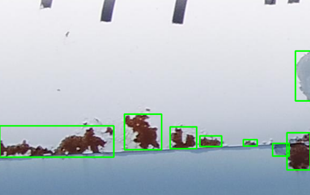
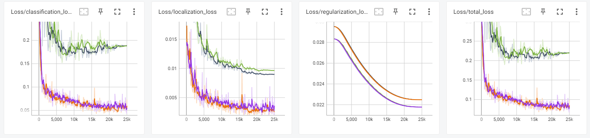
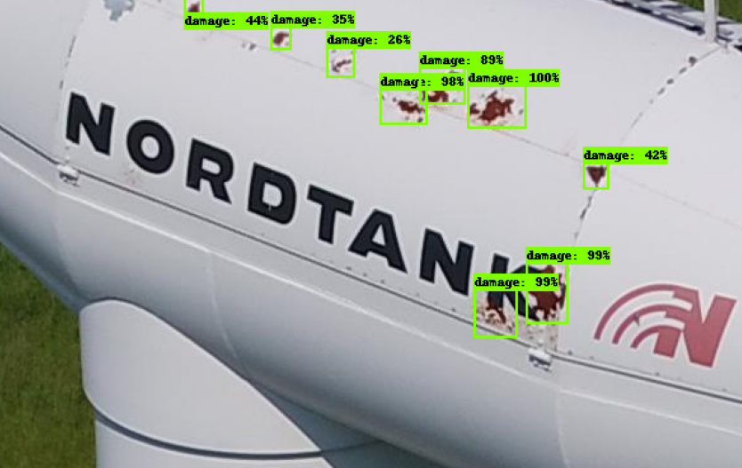
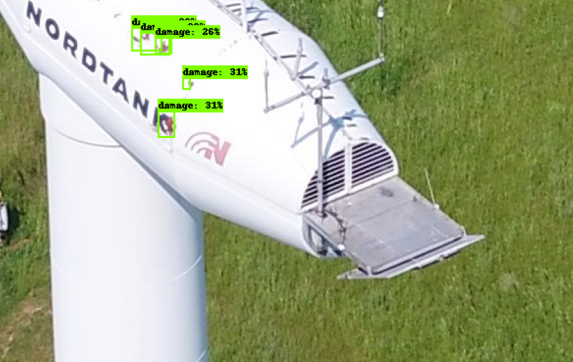
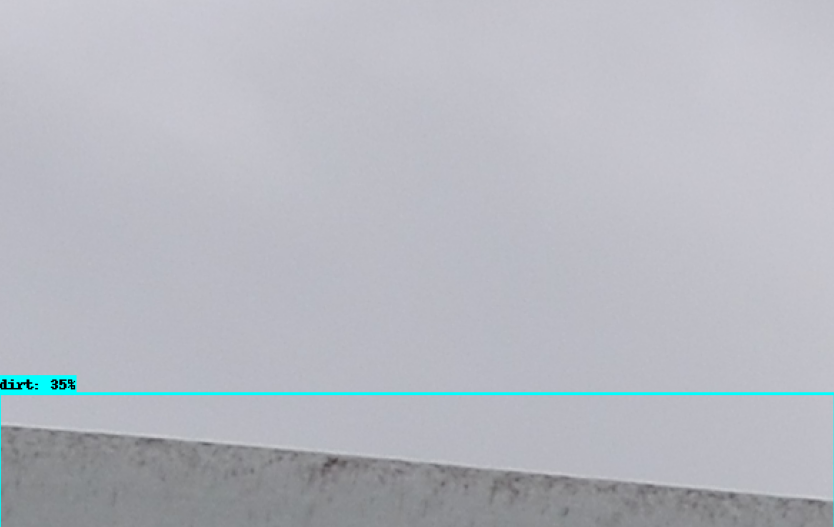
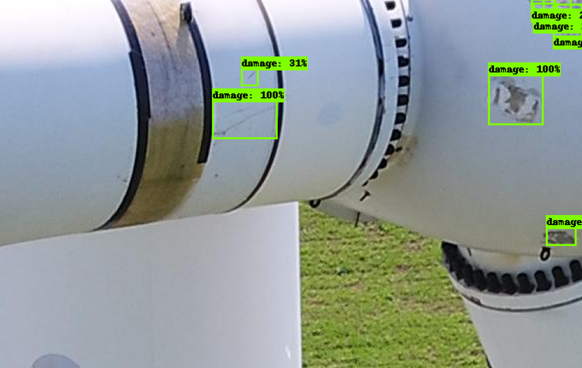
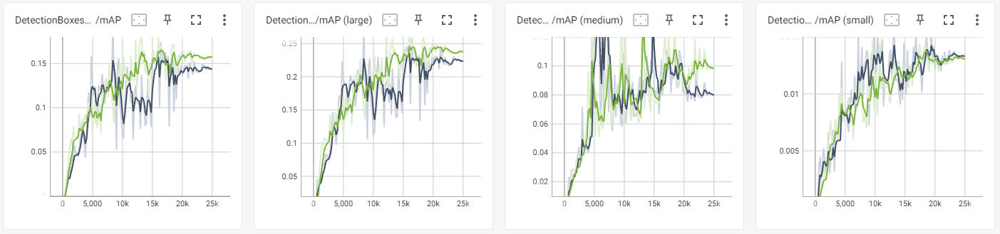
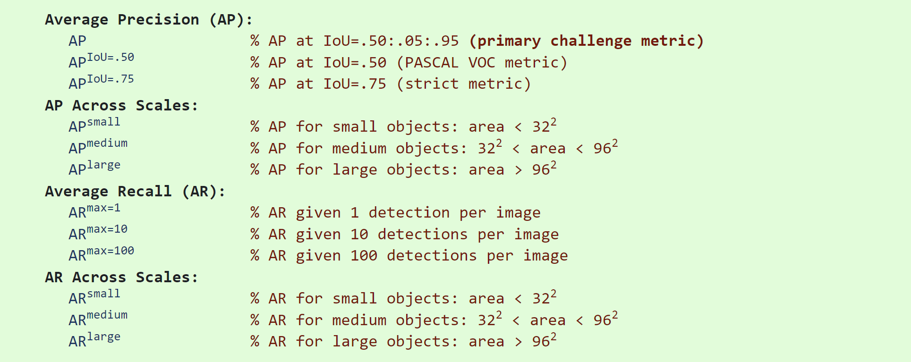

# External Damage Detection

This project uses the TF Object Detection API for automatic external damage and dirt detection on windmills, based on YOLO-annotated drone images.

## Data

Source dataset: [yolo-annotated-wind-turbines-586x371](https://www.kaggle.com/datasets/ajifoster3/yolo-annotated-wind-turbines-586x371)

The original dataset is in YOLO-annotated format, distinguishing between two classes: `damage` and `dirt`. Here's an example:



### From YOLO to TFRecord

Conversion from YOLO annotations to TFRecords was required to use the TensorFlow Object Detection API. For this, an intermediate step to COCO labels was necessary, as there seems to be no direct and successful migration method from YOLO to TFRecord format. Scripts and instructions on how to perform this can be found under the next path: `workspace/annotations_migration/`.

## Models

For this project, multiple versions of the [EfficientDet](https://github.com/tensorflow/models/blob/master/research/object_detection/g3doc/tf2_detection_zoo.md) architecture have been tested.  In particular, architectures EfficientDet D0 and D1 have been tested. Fine-tuning is applied to pre trained model `efficientdet_d0_coco17_tpu-32` with the custom dataset.

## Training process

The training is performed with the TensorFlow Object Detection API, by following the steps from [Netptune AI blog](https://neptune.ai/blog/how-to-train-your-own-object-detector-using-tensorflow-object-detection-api). Scripts and instructions on how to perform the training and export of the model can be found under the next path: `workspace/`

Here are the training configuration options for both architectures D0 and D1:

```
train_config {
  batch_size: 64
  data_augmentation_options {
    random_horizontal_flip {
    }
  }
  data_augmentation_options {
    random_rotation90 {
    }
  }
  data_augmentation_options {
    random_pixel_value_scale {
      minval: 0.9
      maxval: 1.1
    }
  }
  data_augmentation_options {
    # Randomly enlarges or shrinks image (keeping aspect ratio)
    random_image_scale { 
    }
  }
  data_augmentation_options {
    random_adjust_brightness {
      max_delta: 0.2
    }
  }
  data_augmentation_options {
    random_adjust_contrast {
    }
  }
  data_augmentation_options {
    random_adjust_saturation {
    }
  }
  data_augmentation_options {
    # Randomly jitters corners of boxes in the image determined by ratio.
    random_jitter_boxes {
    }
  }
  data_augmentation_options {
    # Randomly crops the image and bounding boxes.
    random_crop_image {
      overlap_thresh: 0.2
      random_coef: 0.5
    }
  }
  data_augmentation_options {
    random_crop_to_aspect_ratio {
      aspect_ratio: 0.85
      overlap_thresh: 0.35
    }
  }
  data_augmentation_options {
    ssd_random_crop {
    }
  }
  data_augmentation_options {
    ssd_random_crop_pad {
    }
  }
  data_augmentation_options {
    random_self_concat_image {
    }
  }
  sync_replicas: true
  optimizer {
    momentum_optimizer {
      learning_rate {
        cosine_decay_learning_rate {
          learning_rate_base: 0.07999999821186066
          total_steps: 25000 # 45000
          warmup_learning_rate: 0.0010000000474974513
          warmup_steps: 2500
        }
      }
      momentum_optimizer_value: 0.8999999761581421
    }
    use_moving_average: false
  }
  fine_tune_checkpoint: "<obfuscated>/Tensorflow/workspace/pre_trained_models/efficientdet_d0_coco17_tpu-32/checkpoint/ckpt-0"
  num_steps: 25000 # 45000
  startup_delay_steps: 0.0
  replicas_to_aggregate: 8
  max_number_of_boxes: 100
  unpad_groundtruth_tensors: false
  fine_tune_checkpoint_type: "detection"
  use_bfloat16: false
  fine_tune_checkpoint_version: V2
}
```

### Data augmentation
Multiple data augmentation options have been set, and while these do reduce the total loss, additional images and further data augmentation options could increase the predictions even more.

### Hyperparameter optimization

#### Loss
From the Tensorboard interface, we can see the classification loss, localization loss, regularization loss, and total loss. Further improvements could be made by tweaking the weights of each loss, currently set to cover the nature of the problem (i.e., detect and classify external damage and dirt):

```
classification_weight: 0.2
localization_weight: 0.4
```

#### Anchor generation
For one-stage object detection models such as EfficientDet, we can improve the model performance by finding the best possible boxes. For this, we set the `aspect_ratios` to the following values. This option defines a ratio for the sides of a rectangular anchor. This is configuration used for this case:

```
anchor_generator {
  multiscale_anchor_generator {
    min_level: 3
    max_level: 7
    anchor_scale: 4.0
    aspect_ratios: 1.0
    aspect_ratios: 2.0
    aspect_ratios: 5.0
    aspect_ratios: 0.5
    scales_per_octave: 3
  }
}
```

### Results

EfficientDet D0 (train: purple, eval: green) and EfficientDet D1 (train: orange, eval: black):



We see that the training dataset does not provide sufficient information to learn the problem, relative to the validation dataset used to evaluate it. This may occur because the training dataset has too few examples as compared to the validation dataset, which can be identified by the learning curve for both the training loss and validation loss showing improvement but with a large gap remaining between them. For this, additional data seems to be required, as no further data augmentation options seem to contribute to the reduction of overfitting.


## Inference

With the previously trained models, we achieve the following results. At first glance, we see that some damages are still being missed and some areas of overlapping that could be improved. That said, the overall result is quite accurate:

<p float="left">
    
    
    
    
    
</p>

## Evaluation

For the evaluation process, we use the Mean Average Precision (mAP) metric. The Object Detection API computes this metric automatically, for reference, here's the internal process:

1. Calculate the probability of a particular bounding box through Intersection Over Union (IoU) - [**IoU = Area of Overlap / Area of Union**]. If there is more than one detection for a single object, the detection having the highest IoU is considered TP, and the rest as FP. In our models, IoU is set to 0.65, which means that if IoU ≥0.65, the object detection is classified as True Positive (TP), if IoU <0.65, then it is a wrong detection and classified as False Positive (FP). Consequently, when the model fails to identify an object, it is classified as False Negative (FN).

2. Infere images in the Testing/Validation set and sort the object detection box results based on the probabilities. 

3. Calculate the accumulated Precision and Recall.

    3.1. **Precision = TP / (TP + FP)** --> It evaluates the number of TP over the number of Positive predictions (i.e., it calculates whether we made a good prediction for every guess).
    
    3.2. **Recall = TP / (TP + FN)** --> It evaluates the number of TP over the number of actual Positives (i.e., it calculates the overall number of correct predictions over all the true positives).
    
    **Note**: This means that there's a tradeoff between the two: if we reduce Precision, we can increase predictions at lower confidence to increase the Recall.
 
    Once the prediction probabilities are sorted, we can calculate the accumulated Precisión and Recall from top to bottom. For example, if we have the ordered sequence (in terms of probability) of [TP, FP, TP, FP], we can compute the accumulated Precisión at each row as 1, 0.5, 0.66 and 0.5. See the following example:
    
| Image   | Detection | Confidence | IoU  | Ground Truth | TP/FP | Acc TP | Acc FP | Precision | Recall |
|---------|-----------|------------|------|--------------|-------|--------|--------|-----------|--------|
| Image 2 | P4        | 98%        | >0.5 | Damage       | TP    | 1      | 0      | 1         | 0.33   |
| Image 2 | P3        | 88%        | >0.5 | Damage       | FP    | 1      | 1      | 0.5       | 0.33   |
| Image 1 | P1        | 78%        | >0.5 | Dirt         | TP    | 2      | 1      | 0.66      | 0.66   |
| Image 1 | P2        | 60%        | <0.5 | -            | FP    | 2      | 2      | 0.5       | 0.66   |

    
The Precision-Recall curve computes the Precision and Recall at different confidence thresholds. It has a log(-x) shape since we reduce the confidence threshold: the Precision decreases and the Recall increases. This curve allows us to calculate single metrics: Area Under the Curve (AUC), or Average Precision (AP). Usually, the Average Precision is computed as the average precision at 11 equally spaced recall levels (11-point interpolation: 0.0, 0.1, 0.2, 0.3, …, 0.9, 1.0). The Mean Average Precision (mAP) is the averaged AP over all the object categories.

With the Tensorflow Object Detection API we obtain the following evolution of mAP during the training process, with the green architecture - EfficientDet D0 - showing a more consistent improvement). EfficientDet D1, on the other hand, shows a lot of variations during the training process. 



We can see that mAP isn't great for medium and small images. One explanation could be that the input images don't have a good resolution, which prevents the model from understanding these types of damages. Another option could be that since images with the `dirt` label are underepresented, the model is unable to precisely detect them. Further study would be required.

### Evaluation metrics:

```
eval_config: {
  metrics_set: "coco_detection_metrics"
  use_moving_averages: false
  batch_size: 1;
}
```

The COCO detection evaluation metrics show 12 metrics:




## Future Improvements

### Improvement in input images

We can see that the mAP metric is quite low, and when this is compared with the results we can see some classification and localization errors, in addition to some overlapping. At this point, and after several tests, one possible solution would be to increase the overall data used for training and evaluation (in partiuclar, increase the overall number of images labeles as `dirst`). Furthermore, because of the low-resolution images, it seems that the mAP values for small and medium objects are very low. A possible improvement would be to increase the resolution of the input images, by using a more sophisticated drone camera to capture them.


### Improvement in evaluation
For the evaluation process, sometimes the mAP is not enough, as the following scenarios could happen and not be independently evaluated:
- the model could find the correct location of the bounding box but output it with an incorrect class
- the model could find an object with a correct class but be wrong about the location of the bounding box
- the model could miss an object entirely
In these scenarios, mAP is not enough, as it does not provide information on what is the percentage of the error caused by classification error, localization error, duplication, etc.

For this, the improvement could be added by using [TIDE](https://dbolya.github.io/tide/), to determine the type of errors happening (e.g., classification, localization, duplicate detection, background error, missed ground truth) and the importance of a given error to the overall mAP. This framework also computes how the mAP would increase if this type of error didn't exist, which is crucial information on how to improve the model.
